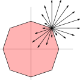

<!-- README.md is generated from README.Rmd. Please edit that file -->

# SLOPE <a href="https://jolars.github.io/SLOPE/"></a>

<!-- badges: start -->

[](https://github.com/jolars/SLOPE/actions)
[](https://codecov.io/github/jolars/SLOPE?branch=master)
[](https://CRAN.R-project.org/package=SLOPE)
[](https://lifecycle.r-lib.org/articles/stages.html#experimental)
<!-- badges: end -->

Efficient implementations for Sorted L-One Penalized Estimation (SLOPE):
generalized linear models regularized with the sorted L1-norm. There is
support for ordinary least-squares regression, binomial regression,
multinomial regression, and poisson regression, as well as both dense
and sparse predictor matrices. In addition, the package features
predictor screening rules that enable efficient solutions to
high-dimensional problems.

## Installation

You can install the current stable release from
[CRAN](https://cran.r-project.org/) with

``` r
install.packages("SLOPE")
```

or the development version from [GitHub](https://github.com/) with

``` r
# install.packages("remotes")
remotes::install_github("jolars/SLOPE")
```

## Versioning

SLOPE uses [semantic versioning](https://semver.org).

## Code of conduct

Please note that the ‘SLOPE’ project is released with a [Contributor
Code of Conduct](https://jolars.github.io/SLOPE/CODE_OF_CONDUCT.html).
By contributing to this project, you agree to abide by its terms.
