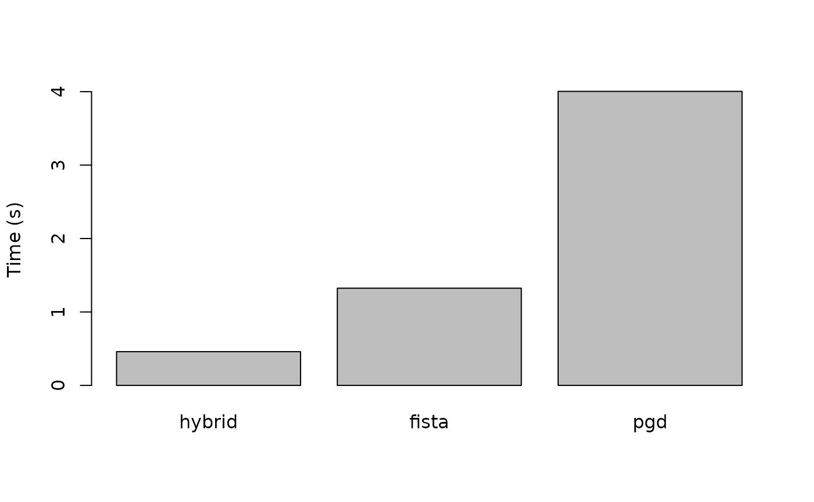
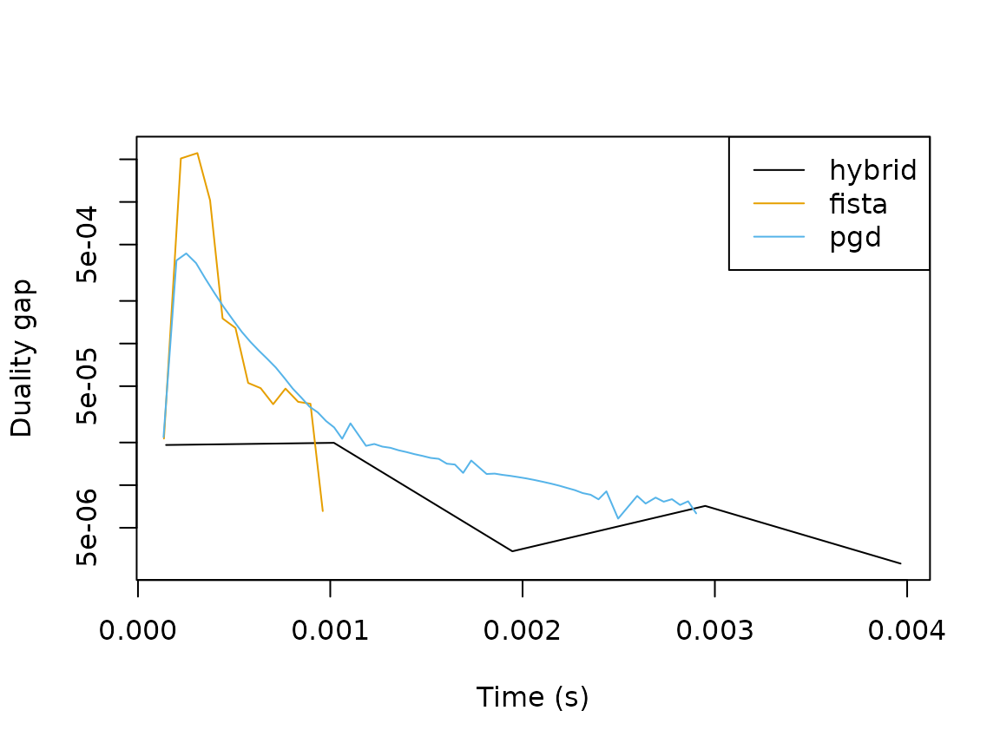

# Solvers in SLOPE

## Solvers

SLOPE supports different solvers for solving the optimization problem.
At the moment, we feature three different solvers:

- A Hybrid solver
- Proximal Gradient Descent (PGD)
- Fast Iterative Shrinkage-Thresholding Algorithm (FISTA)

The first of these, the Hybrid method, is an optimization algorithm
developed developed by Larsson et al. (2023). It is a combination of
proximal gradient descent and coordinate descent and is generally the
preferred method, although currently not available for the multinomial
logistic regression objective and turned off by default for Poisson
regression due to numerical issues with the Newton step in the IRLS
updates.

PGD is a simple and robust method that should work for any of the
problems here.

FISTA is an accelerated version of PGD and the fallback default whenever
the hybrid method isn’t available (or for the Poisson regression
problem).

## Example

Here we show a simple example of how the solvers compare for a logistic
regression problem with 100 observations and 10000 predictors. We
iterate over the solvers and fit a full SLOPE path using the default
settings in the package, setting `diagnostics = TRUE` to collect primal
and dual values in order to compute duality gaps (upper bounds on
suboptimality) for the different solvers.

``` r
library(SLOPE)

response <- "binomial"

data <- SLOPE:::randomProblem(n = 100, p = 1000, response = response)

solvers <- c("hybrid", "fista", "pgd")

fits <- lapply(solvers, function(solver) {
  fit <- SLOPE(
    data$x,
    data$y,
    family = response,
    solver = solver,
    diagnostics = TRUE
  )
})
```

First, we just compute the total time spent in each solver.

``` r
total_time <- sapply(
  fits,
  function(x) {
    sum(sapply(x$diagnostics[["time"]], tail, n = 1))
  }
)

names(total_time) <- solvers

barplot(total_time, ylab = "Time (s)")
```



Here is is clear that the hybrid method performs best followed by FISTA
and PGD.

To see how the solvers compare for a single objective along the path, we
collect the gaps at step 40 for each solver.

``` r
pen_minmax <- min(
  vapply(fits, function(fit) {
    max(fit$diagnostics$penalty)
  }, FUN.VALUE = numeric(1))
)

res <- lapply(seq_along(fits), function(i) {
  fit <- fits[[i]]
  solver <- solvers[[i]]
  d <- fit$diagnostics[fit$diagnostics$penalty == pen_minmax, ]
  data.frame(
    solver = solver,
    time = d$time,
    gap = d$primal - d$dual
  )
})
```

Then we plot progress on the objective for each solver.

``` r
ylim <- range(unlist(lapply(res, function(x) x$gap)))

colors <- palette.colors(
  n = length(solvers),
  palette = "Okabe-Ito"
)

plot(
  res[[1]]$time,
  res[[1]]$gap,
  type = "n",
  ylim = ylim,
  xlab = "Time (s)",
  ylab = "Duality gap",
  log = "y"
)

for (i in seq_along(solvers)) {
  lines(res[[i]]$time, res[[i]]$gap, col = colors[i])
}

legend("topright", legend = solvers, col = colors, lty = 1)
```



## References

Larsson, Johan, Quentin Klopfenstein, Mathurin Massias, and Jonas
Wallin. 2023. “Coordinate Descent for SLOPE.” In *Proceedings of the
26th International Conference on Artificial Intelligence and
Statistics*, edited by Francisco Ruiz, Jennifer Dy, and Jan-Willem van
de Meent, 206:4802–21. Proceedings of Machine Learning Research.
Valencia, Spain: PMLR.
<https://proceedings.mlr.press/v206/larsson23a.html>.
