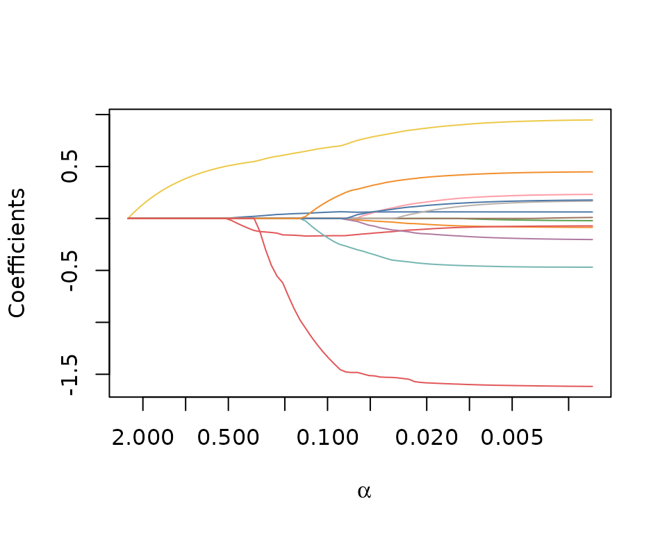
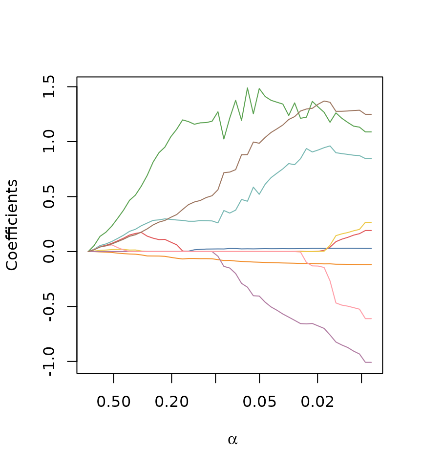
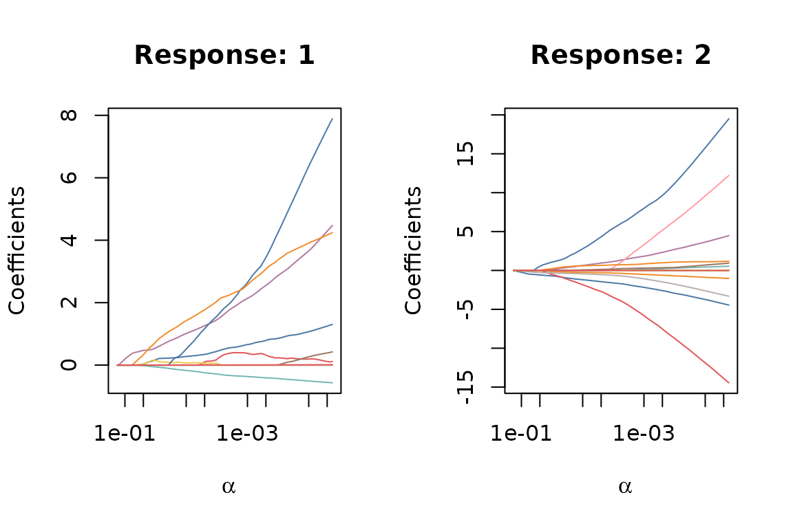

# Models in SLOPE

## Models

Sorted L-One Penalized Estimation (SLOPE) is the procedure of minimizing
objectives of the type
$${minimize}\left\{ F\left( \beta_{0},\beta;X,y \right) + J(\beta;\alpha,\lambda) \right\},$$
where
$$J(\beta;\alpha,\lambda) = \alpha\sum\limits_{j = 1}^{p}\lambda_{j}|\beta|_{(j)},$$
with $\alpha \in {\mathbb{R}}_{+}$, $\lambda \in {\mathbb{R}}_{+}^{p}$
and $(j)$ represents an rank of the magnitudes of $\beta$ in descending
order. $\lambda$ controls the shape of the penalty sequence, which needs
to be non-increasing, and $\alpha$ controls the scale of that sequence.

$X$ and $Y$ are the design matrix and response matrix, respectively,
which are of dimensions $n \times p$ and $n \times m$ respectively.
Except for multinomial logistic regression, $m = 1$.

We assume that $F$ takes the following form:
$$F\left( \beta_{0},\beta \right) = \frac{1}{n}\sum\limits_{i = 1}^{n}f\left( \beta_{0} + x_{i}^{\intercal}\beta,y_{i} \right),$$
where $f$ is a smooth and convex loss function from the family of
generalized linear models (GLMs), $x_{i}$ is the $i$th row of the design
matrix $X$, and $y_{i}$ is the $i$th row of the response matrix $Y$.

SLOPE currently supports four different models from the family of
generalized linear models (GLMs):

- Least-squares (Gaussian) regression,
- Logistic regression,
- Multinomial logistic regression, and
- Poisson regression.

Due to the way GLMs are formulated, each model is defined by three
components: a loss function $f(\eta,y)$, a link function $g(\mu)$, and
an inverse link function $g^{- 1}(\eta)$. Here, $\eta$ is the linear
predictor, and $\mu$ is the mean of the response variable.

| Model       |                                                 $f(\eta,y)$                                                  |                 $g(\mu)$                 |                      $g^{- 1}(\eta)$                      |
|:------------|:------------------------------------------------------------------------------------------------------------:|:----------------------------------------:|:---------------------------------------------------------:|
| Gaussian    |                                         $\frac{1}{2}(y - \eta)^{2}$                                          |                  $\mu$                   |                          $\eta$                           |
| Binomial    |                                  $\log\left( 1 + e^{\eta} \right) - \eta y$                                  | $\log\left( \frac{\mu}{1 - \mu} \right)$ |              $\frac{e^{\eta}}{1 + e^{\eta}}$              |
| Poisson     |                                             $e^{\eta} - \eta y$                                              |               $\log(\mu)$                |                        $e^{\eta}$                         |
| Multinomial | $\sum_{k = 1}^{m - 1}\left( \log\left( 1 + \sum_{j = 1}^{m - 1}e^{\eta_{j}} \right) - y_{k}\eta_{k} \right)$ | $\log\left( \frac{\mu}{1 - \mu} \right)$ | $\frac{\exp(\eta)}{1 + \sum_{j = 1}^{m - 1}e^{\eta_{j}}}$ |

Loss functions, link functions, and inverse link functions for
generalized linear models in the SLOPE package. Note that in the case of
multinomial logistic regression, the input is vector-valued, and we
allow $\log$ and $\exp$ to be overloaded to apply element-wise in these
cases.

## Gaussian Regression

Gaussian regression, also known as least-squares regression, is used for
continuous response variables, and takes the following form:
$$f\left( \beta,\beta_{0};X,y \right) = \frac{1}{2n}\sum\limits_{i = 1}^{n}\left( y_{i} - x_{i}^{\intercal}\beta - \beta_{0} \right)^{2}.$$

You select it by setting `family = "gaussian"` in the
[`SLOPE()`](https://jolars.github.io/SLOPE/dev/reference/SLOPE.md)
function. In the following example, we fit a Gaussian SLOPE model to the
`bodyfat` data set, which is included in the package:

``` r
library(SLOPE)

fit_gaussian <- SLOPE(
  x = bodyfat$x,
  y = bodyfat$y,
  family = "gaussian"
)
```

Often it’s instructive to look at the solution path of the fitted model,
which you can do by simply plotting the fitted object:

``` r
plot(fit_gaussian)
```



We can also print a summary of the fitted model:

``` r
summary(fit_gaussian)
#> 
#> Call:
#> SLOPE(x = bodyfat$x, y = bodyfat$y, family = "gaussian") 
#> 
#> Family: gaussian 
#> Observations: 252 
#> Predictors: 13 
#> Intercept: Yes 
#> 
#> Regularization path:
#>   Length: 82 steps
#>   Alpha range: 0.00136 to 2.55 
#>   Deviance ratio range: 0 to 0.749 
#>   Null deviance: 69.8 
#> 
#> Path summary (first and last 5 steps):
#>    alpha deviance_ratio n_nonzero
#>  2.55000          0.000         0
#>  2.32000          0.112         1
#>  2.12000          0.206         1
#>  1.93000          0.283         1
#>  1.76000          0.347         1
#>  . . .
#>   0.00197          0.749        13
#>   0.00180          0.749        13
#>   0.00164          0.749        13
#>   0.00149          0.749        13
#>   0.00136          0.749        13
```

SLOPE also contains standard methods for returning coefficients and
making predictions. We can use
[`coef()`](https://rdrr.io/r/stats/coef.html) with a specified level of
regularization `alpha`, to obtain the coefficients at that level (or
omit `alpha` to get the coefficients for the full path).

``` r
coef(fit_gaussian, alpha = 0.05)
#> 14 x 1 sparse Matrix of class "dgCMatrix"
#>                  
#>  [1,] -8.23495024
#>  [2,]  0.06136933
#>  [3,] -0.02255158
#>  [4,] -0.14420771
#>  [5,] -0.33756633
#>  [6,]  .         
#>  [7,]  0.78053158
#>  [8,] -0.06724996
#>  [9,]  0.04675465
#> [10,]  .         
#> [11,]  .         
#> [12,]  0.05947536
#> [13,]  0.31293830
#> [14,] -1.51314119
```

To make predictions on new data, we can use the
[`predict()`](https://rdrr.io/r/stats/predict.html) function, specifying
the fitted model, new design matrix `x`, and the level of regularization
`alpha`:

``` r
y_hat <- predict(fit_gaussian, x = bodyfat$x[1:5, ], alpha = 0.01)

plot(bodyfat$y[1:5], y_hat)
```


## Logistic Regression

Logistic regression is used for binary classification problems, and
takes the following form:
$$f\left( \beta_{0},\beta;X,y \right) = \frac{1}{n}\sum\limits_{i = 1}^{n}\left\{ \log\left( 1 + \exp\left( x_{i}^{T}\beta + \beta_{0} \right) \right) - y_{i}x_{i}^{T}\beta \right\},$$
where $X_{i}$ is the $i$th row of the design matrix $X$.

You select it by setting `family = "binomial"` in the
[`SLOPE()`](https://jolars.github.io/SLOPE/dev/reference/SLOPE.md)
function.

``` r
fit_logistic <- SLOPE(
  x = heart$x,
  y = heart$y,
  family = "binomial"
)
```

You can plot the solution path, print a summary, extract coefficients,
and make predictions in the same way as for Gaussian regression:

``` r
plot(fit_logistic)
```


## Poisson Regression

Poisson regression is used for count data, and takes the following form:
$$f\left( \beta_{0},\beta;X,y \right) = \frac{1}{n}\sum\limits_{i = 1}^{n}\left\{ \exp\left( x_{i}^{T}\beta + \beta_{0} \right) - y_{i}x_{i}^{T}\beta \right\}.$$

You select it by setting `family = "poisson"` in the
[`SLOPE()`](https://jolars.github.io/SLOPE/dev/reference/SLOPE.md)
function. Note that the solving the Poisson regression problem is a
notoriously difficult optimization problem, which is not
Lipschitz-smooth. As such, convergence may be slow. SLOPE features
safeguards to ensure convergence by modifying step sizes, but this may
lead to long computation times in some cases.

In the next example, we fit a Poisson SLOPE model to the `abalone` data
set, which consists of observations of abalones.

``` r
fit_poisson <- SLOPE(
  x = abalone$x,
  y = abalone$y,
  family = "poisson"
)

plot(fit_poisson)
```



### Numerical Considerations

Sometimes it may be beneficial to pick a gradient descent solver instead
of the default coordinate descent solver.

## Multinomial Logistic Regression

Multinomial logistic regression is used for multi-class classification
problems, and takes the following form:
$$f\left( \beta_{0},\beta;X,Y \right) = \frac{1}{n}\sum\limits_{i = 1}^{n}\left\{ \log\left( 1 + \sum\limits_{k = 1}^{m - 1}\exp\left( x_{i}^{T}\beta_{k} + \beta_{0k} \right) \right) - \sum\limits_{k = 1}^{m - 1}y_{ik}\left( x_{i}^{T}\beta_{k} + \beta_{0k} \right) \right\},$$
where $X_{i}$ is the $i$th row of the design matrix $X$, and $Y$ is the
response matrix of dimension $n \times m$, where $m$ is the number of
classes.

In our package, we use the non-redundant formulation, where the last
class is treated as the baseline class. Thus, only $m - 1$ sets of
coefficients are estimated. This is not the case in other packages, such
as `glmnet` (Friedman, Hastie, and Tibshirani 2010).

To select multinomial logistic regression, set `family = "multinomial"`
in the
[`SLOPE()`](https://jolars.github.io/SLOPE/dev/reference/SLOPE.md)
function. In the following example, we fit a multinomial logistic SLOPE
model to the `wine` data set, which consists of 178 observations of
wines from three different cultivars. The task is to classify the
cultivar based on 13 different chemical properties.

``` r
fit_multinomial <- SLOPE(
  x = wine$x,
  y = wine$y,
  family = "multinomial"
)
```

Note that the coefficients are now a matrix. To retain sparsity, we have
chosen to return the full set of coefficients along the path as a list
of sparse matrices. Here we extract the coefficients for the second step
in the solution path, which consists of one matrix, with one column for
the coefficients of the first two classes (the third class is the
baseline class):

``` r
fit_multinomial$coefficients[[2]]
#> 13 x 2 sparse Matrix of class "dgCMatrix"
#>                               
#>  [1,] .            -0.07330687
#>  [2,] .             .         
#>  [3,] .             .         
#>  [4,] .             .         
#>  [5,] .             .         
#>  [6,] .             .         
#>  [7,] 0.0259610440  .         
#>  [8,] .             .         
#>  [9,] .             .         
#> [10,] .            -0.02567089
#> [11,] .             .         
#> [12,] .             .         
#> [13,] 0.0003541809  .
```

By default, [`coef()`](https://rdrr.io/r/stats/coef.html) simplifies the
output and returns three lists of coefficient vectors, one for each
class (excluding the baseline class).

For similar reasons, plotting the paths is also a bit different and in
SLOPE we plot a path for each class (excluding the baseline class),
which resembles the result from calling
[`coef()`](https://rdrr.io/r/stats/coef.html). Because we use the base R
plotting system, you need to setup a multi-panel layout to see all the
paths:

``` r
par(mfrow = c(1, 2))
plot(fit_multinomial)
```



## References

Friedman, Jerome, Trevor Hastie, and Robert Tibshirani. 2010.
“Regularization Paths for Generalized Linear Models via Coordinate
Descent.” *Journal of Statistical Software* 33 (1): 1–22.
<https://doi.org/10.18637/jss.v033.i01>.
