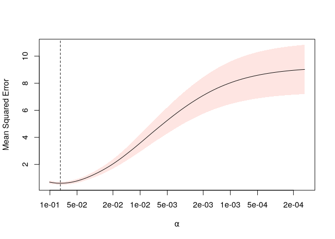

# SLOPE

Efficient implementations for Sorted L-One Penalized Estimation (SLOPE):
generalized linear models regularized with the sorted L1-norm.

## Features

- Gaussian (quadratic), binomial (logistic), multinomial logistic, and
  Poisson regression
- Sparse and dense input matrices
- Efficient hybrid coordinate descent algorithm
- Predictor (feature) screening rules that speed up fitting in
  high-dimensional settings
- Cross-validation
- Parallelized routines
- Duality-based stopping criteria for robust control of suboptimality

## Installation

You can install the current stable release from
[CRAN](https://cran.r-project.org/) with the following command:

``` r
install.packages("SLOPE")
```

Alternatively, you can install the development version from
[GitHub](https://github.com/) with the following command:

``` r
# install.packages("pak")
pak::pak("jolars/SLOPE")
```

## Getting Started

By default, SLOPE fits a full regularization path to the given data.
Here is an example of fitting a logistic SLOPE model to the built-in
`heart` dataset.

``` r
library(SLOPE)

fit <- SLOPE(heart$x, heart$y, family = "binomial")
```

We can plot the resulting regularization path:

``` r
plot(fit)
```


We can also perform cross-validation to select optimal scaling of the
regularization sequence:

``` r
set.seed(18)

cvfit <- cvSLOPE(heart$x, heart$y, family = "binomial")
plot(cvfit)
```



## Versioning

SLOPE uses [semantic versioning](https://semver.org).

## Code of conduct

Please note that the ‘SLOPE’ project is released with a [Contributor
Code of Conduct](https://jolars.github.io/SLOPE/CODE_OF_CONDUCT.html).
By contributing to this project, you agree to abide by its terms.
